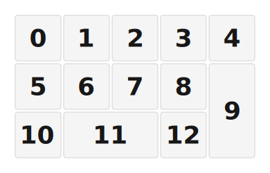

# ZMK Configuration for trk-numpad

*Generated by Shield Wizard for ZMK*



Download compiled firmware from the Actions tab. <https://zmk.dev/docs/user-setup#installing-the-firmware>

Edit your keymap <https://zmk.dev/docs/keymaps>.
User keymap is located at [`config/trk_numpad.keymap`](config/trk_numpad.keymap).

-----

<details>
<summary>
Shield Wizard Debug Information
</summary>

In case of broken configuration, here is the Shield Wizard internal data used to generate this configuration:

Commit: 5840d41ac0915092c8fe45da617ffb4bb91e1b97

```json
{"name":"trk-numpad","shield":"trk_numpad","dongle":false,"modules":[],"layout":[{"id":"01KM3TQZ26PCJNDM0XE5WC831G","part":0,"row":0,"col":0,"w":1,"h":1,"x":0,"y":0,"r":0,"rx":0,"ry":0},{"id":"01KM3TR1D6X2KZJJHJRD9Z4MT7","part":0,"row":0,"col":1,"w":1,"h":1,"x":1,"y":0,"r":0,"rx":0,"ry":0},{"id":"01KM3TR1W2JTS26MGE9K00536P","part":0,"row":0,"col":2,"w":1,"h":1,"x":2,"y":0,"r":0,"rx":0,"ry":0},{"id":"01KM3TR243KWEGJ45Z82JMKMQR","part":0,"row":0,"col":3,"w":1,"h":1,"x":3,"y":0,"r":0,"rx":0,"ry":0},{"id":"01KM3TR2CE2AZ77BFADH3BAQ6Y","part":0,"row":0,"col":4,"w":1,"h":1,"x":4,"y":0,"r":0,"rx":0,"ry":0},{"id":"01KM3TR3W8GVB7RXAV1MHT2GT4","part":0,"row":1,"col":0,"w":1,"h":1,"x":0,"y":1,"r":0,"rx":0,"ry":0},{"id":"01KM3TR449NN2M5ZMZ7BDGMKC2","part":0,"row":1,"col":1,"w":1,"h":1,"x":1,"y":1,"r":0,"rx":0,"ry":0},{"id":"01KM3TR4ABJRCPH42BRBCHTEWE","part":0,"row":1,"col":2,"w":1,"h":1,"x":2,"y":1,"r":0,"rx":0,"ry":0},{"id":"01KM3TT88FF63BDCMXAGYS8MQK","part":0,"row":1,"col":3,"w":1,"h":1,"x":3,"y":1,"r":0,"rx":0,"ry":0},{"id":"01KM3TT8ZMV1R4QHBVY2DYSRN5","part":0,"row":1,"col":4,"w":1,"h":2,"x":4,"y":1,"r":0,"rx":0,"ry":0},{"id":"01KM3TTQKNJTR6BTE2HYQH1MEB","part":0,"row":2,"col":0,"w":1,"h":1,"x":0,"y":2,"r":0,"rx":0,"ry":0},{"id":"01KM3TWC9A3QKGM9F6X4WXJP90","part":0,"row":2,"col":1,"w":2,"h":1,"x":1,"y":2,"r":0,"rx":0,"ry":0},{"id":"01KM3TWCGDR1Z8Z9P3EY9GKYX9","part":0,"row":2,"col":3,"w":1,"h":1,"x":3,"y":2,"r":0,"rx":0,"ry":0}],"parts":[{"name":"trknumpad","controller":"nice_nano_v2","wiring":"matrix_diode","pins":{"d14":"input","d15":"input","d18":"input","d19":"input","d20":"input","d16":"output","d10":"output","d9":"output"},"keys":{"01KM3TR1D6X2KZJJHJRD9Z4MT7":{"input":"d15","output":"d16"},"01KM3TQZ26PCJNDM0XE5WC831G":{"input":"d14","output":"d16"},"01KM3TR1W2JTS26MGE9K00536P":{"input":"d18","output":"d16"},"01KM3TR243KWEGJ45Z82JMKMQR":{"input":"d19","output":"d16"},"01KM3TR2CE2AZ77BFADH3BAQ6Y":{"input":"d20","output":"d16"},"01KM3TR3W8GVB7RXAV1MHT2GT4":{"input":"d14","output":"d10"},"01KM3TTQKNJTR6BTE2HYQH1MEB":{"input":"d14","output":"d9"},"01KM3TR449NN2M5ZMZ7BDGMKC2":{"input":"d15","output":"d10"},"01KM3TWC9A3QKGM9F6X4WXJP90":{"input":"d15","output":"d9"},"01KM3TR4ABJRCPH42BRBCHTEWE":{"input":"d18","output":"d10"},"01KM3TT88FF63BDCMXAGYS8MQK":{"input":"d19","output":"d10"},"01KM3TWCGDR1Z8Z9P3EY9GKYX9":{"input":"d19","output":"d9"},"01KM3TT8ZMV1R4QHBVY2DYSRN5":{"input":"d20","output":"d10"}},"encoders":[],"buses":[{"name":"spi0","devices":[],"type":"spi"},{"name":"spi1","devices":[],"type":"spi"},{"name":"spi2","devices":[],"type":"spi"},{"name":"spi3","devices":[],"type":"spi"},{"name":"i2c0","devices":[],"type":"i2c"},{"name":"i2c1","devices":[],"type":"i2c"}]}]}
```

</details>
